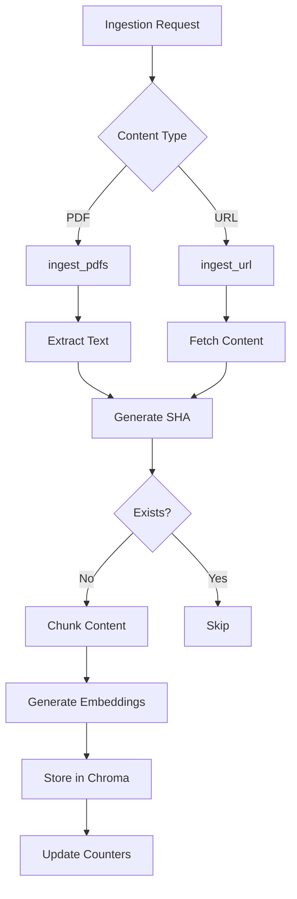
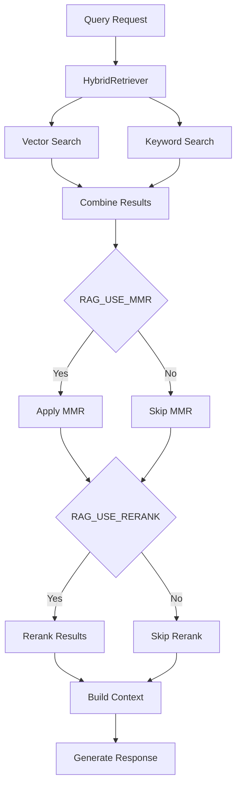
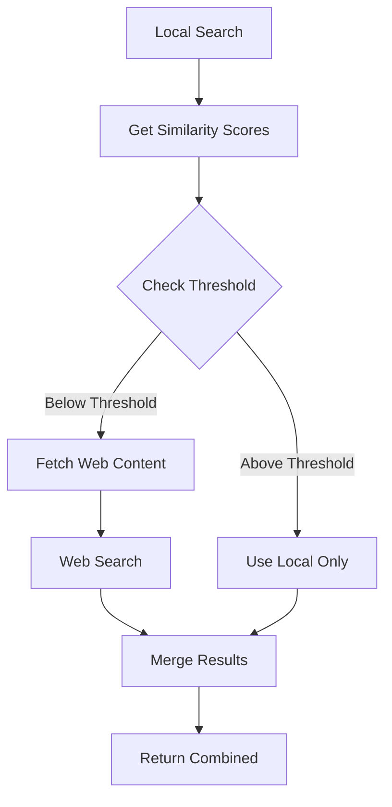

# Your-Agent System Documentation

## High-Level Overview

### 1. System Architecture

This is a RAG (Retrieval Augmented Generation) system built with FastAPI that combines local document storage with web-based content retrieval. The system provides intelligent document ingestion, retrieval, and question-answering capabilities.

#### Core Components

1. **Document Ingestion System**
   - PDF document ingestion
   - URL content ingestion
   - TTL-based web content management
   - Idempotent ingestion with SHA IDs

2. **Retrieval System**
   - Hybrid retrieval (Vector + Keyword search)
   - MMR-based diversity optimization
   - Reranking capability
   - Score-based web content gating

3. **Query System**
   - Streaming chat interface
   - Citation attribution
   - Rate limiting and backoff
   - Context-aware responses

4. **Storage System**
   - Chroma vector store
   - Separate stores for local and web content
   - TTL-aware document management

### 2. Key Features

#### A. Ingestion Pipeline
- PDF document processing
- Web content capture
- Document chunking
- Vector embedding
- SHA-based deduplication

#### B. Retrieval Enhancement
- MMR (Maximal Marginal Relevance)
- Pluggable reranker
- Hybrid search combining vector and keyword approaches
- Similarity score-based web augmentation

#### C. API Endpoints
- `/ingest`: PDF document ingestion
- `/ingest_url`: Web content ingestion
- `/documents`: Document listing
- `/healthz`: System health check
- `/chat`: Streaming chat interface
- `/query`: Direct querying

## Low-Level Flow

### 1. Document Ingestion Flow


### 2. Query Processing Flow


### 3. Web Augmentation Flow


## Technical Implementation Details

### 1. Environment Configuration
```python
# Key Environment Variables
RAG_TOP_K=5                    # Number of results to return
RAG_FETCH_K=20                 # Initial fetch size for MMR
RAG_USE_MMR=true              # Enable MMR diversity
RAG_USE_RERANK=false          # Enable reranking
MAX_TOKENS_CONTEXT=3000       # Max context size
RAG_WEB_SIMILARITY_THRESHOLD=0.7  # Web fetch threshold
```

### 2. Retrieval System Architecture

#### HybridRetriever Class
```python
class HybridRetriever:
    def get_relevant_documents_with_scores(self, query):
        # Vector search
        vector_results = self.vector_store.similarity_search(query)
        
        # Keyword search
        keyword_results = self.keyword_search(query)
        
        # Combine and score
        combined = self.merge_results(vector_results, keyword_results)
        
        # Apply MMR if enabled
        if self.use_mmr:
            combined = self.apply_mmr(combined)
            
        return combined
```

### 3. API Endpoints Structure

```python
@app.post("/ingest")
async def ingest_documents(files: List[UploadFile]):
    # Background task for ingestion
    background_tasks.add_task(ingest_pdfs, files)
    return {"status": "processing"}

@app.post("/ingest_url")
async def ingest_web_content(url: str):
    # TTL-aware web ingestion
    background_tasks.add_task(ingest_url, url)
    return {"status": "processing"}

@app.get("/chat")
async def chat_endpoint(query: str):
    # Streaming response with citations
    return EventSourceResponse(generate_stream(query))
```

## System Components

### 1. Document Processor
- Handles various document formats
- Implements chunking strategies
- Manages document metadata
- Ensures idempotent processing

### 2. Vector Store Manager
- Manages Chroma instances
- Handles embeddings generation
- Implements TTL management
- Provides search interfaces

### 3. Retrieval Engine
- Implements hybrid search
- Manages MMR diversity
- Handles reranking
- Controls web augmentation

### 4. API Layer
- Implements FastAPI endpoints
- Manages async operations
- Handles streaming responses
- Implements rate limiting

## Performance Optimization

### 1. Chunking Strategy
- Optimal chunk size determination
- Overlap configuration
- Metadata preservation
- Content cleaning

### 2. Search Optimization
- MMR parameter tuning
- Fetch size optimization
- Score threshold calibration
- Cache management

### 3. Resource Management
- Background task scheduling
- Rate limiting implementation
- Memory usage optimization
- Connection pooling

## Monitoring and Logging

### 1. Structured Logging
```json
{
    "timestamp": "2025-11-04T10:00:00Z",
    "route": "/query",
    "query": "example query",
    "docs_retrieved": 5,
    "latency_ms": 150,
    "tokens_used": 1000
}
```

### 2. Health Metrics
- Document count
- Chunk statistics
- Provider status
- System resources

## Future Enhancements

1. **Advanced Features**
   - Cross-document reasoning
   - Multi-modal content support
   - Advanced caching strategies
   - Enhanced citation system

2. **UI Improvements**
   - Interactive citations
   - Real-time feedback
   - Progress indicators
   - Advanced visualization

3. **System Optimization**
   - Distributed processing
   - Advanced caching
   - Parallel ingestion
   - Enhanced monitoring

## Security Considerations

1. **Data Protection**
   - Input sanitization
   - Access control
   - Rate limiting
   - Content validation

2. **System Security**
   - API authentication
   - Request validation
   - Error handling
   - Logging security

This documentation provides a comprehensive overview of the your-agent system, including both high-level architecture and low-level implementation details. The Mermaid diagrams illustrate key workflows and system interactions.