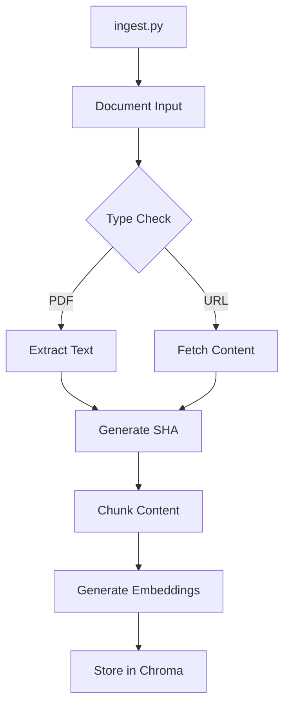
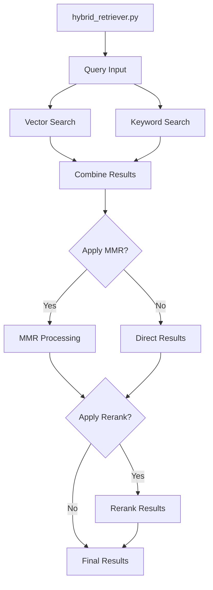
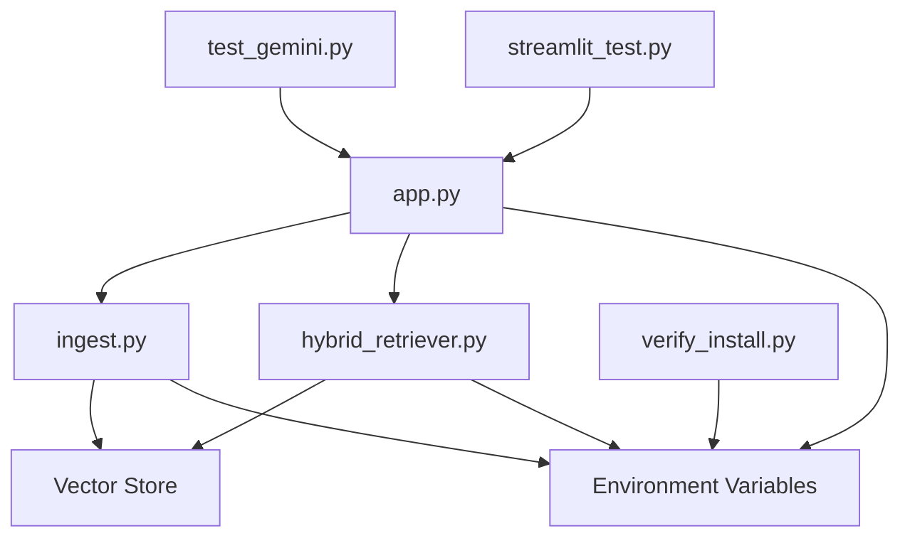
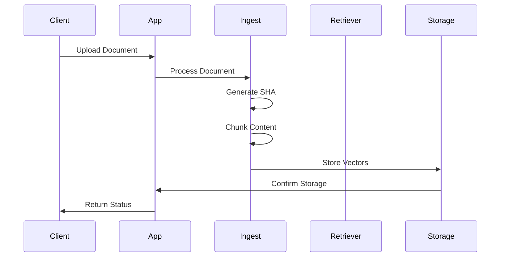
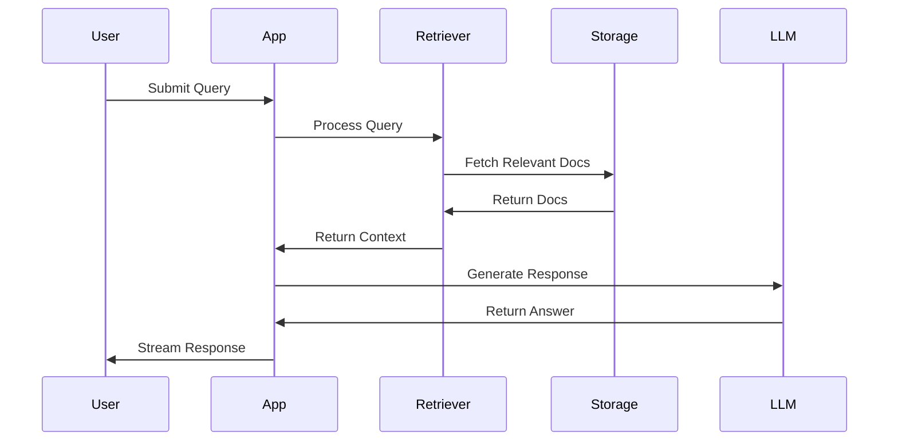

# Detailed Project Component Analysis

## Environment Components

### 1. Virtual Environment (venv)
- **Purpose**: Isolated Python environment for project dependencies
- **Location**: Project root directory
- **Contents**:
  - Python interpreter
  - Project-specific packages
  - Dependency isolation from system Python

### 2. pytest.cache
- **Purpose**: Cache directory for pytest test framework
- **Contents**:
  - Test execution history
  - Test timing information
  - Last failed tests cache
  - Performance optimization data

## Python Files Analysis

### 1. `app.py`
**Purpose**: Main FastAPI application server
```mermaid
graph TD
    A[app.py] --> B[Initialize FastAPI]
    B --> C[Load Environment Variables]
    C --> D[Initialize Vector Stores]
    D --> E[Setup Endpoints]
    E --> F[/ingest]
    E --> G[/ingest_url]
    E --> H[/documents]
    E --> I[/healthz]
    E --> J[/chat]
    E --> K[/query]
```

**Key Functions**:
1. `startup_event()`
   - Initializes Chroma stores
   - Loads environment variables
   - Sets up logging

2. `ingest_endpoint()`
   - Handles document ingestion
   - Creates background tasks
   - Returns ingestion status

3. `chat_endpoint()`
   - Implements SSE streaming
   - Manages citations
   - Handles rate limiting

### 2. `ingest.py`
**Purpose**: Document ingestion and processing


**Key Functions**:
1. `ingest_pdfs()`
   - PDF text extraction
   - Document chunking
   - SHA ID generation
   - Vector store insertion

2. `ingest_url()`
   - Web content fetching
   - TTL management
   - Content processing
   - Web store insertion

### 3. `hybrid_retriever.py`
**Purpose**: Advanced document retrieval system


**Key Functions**:
1. `get_relevant_documents()`
   - Hybrid search implementation
   - Result combination
   - Score calculation

2. `apply_mmr()`
   - Diversity optimization
   - Result reranking
   - Score adjustment

### 4. `verify_install.py`
**Purpose**: Installation verification
- Checks environment setup
- Validates dependencies
- Tests core functionality

### 5. `test_gemini.py`
**Purpose**: Gemini API testing
- API connection tests
- Response validation
- Error handling checks

### 6. `streamlit_test.py`
**Purpose**: UI testing with Streamlit
- Interface testing
- User interaction validation
- Visual component checks

## File Interactions and Dependencies



## Detailed Component Actions

### 1. Document Processing Pipeline


### 2. Query Processing Pipeline


## Environment Variables
```ini
# Core Configuration
RAG_TOP_K=5
RAG_FETCH_K=20
RAG_USE_MMR=true
RAG_USE_RERANK=false
MAX_TOKENS_CONTEXT=3000

# Web Integration
RAG_WEB_SIMILARITY_THRESHOLD=0.7
RAG_WEB_SIMILARITY_HIGHER_IS_BETTER=true

# System Settings
LOG_LEVEL=INFO
CHUNK_SIZE=512
CHUNK_OVERLAP=50
```

## Development Tools

### 1. pytest
- **Purpose**: Testing framework
- **Features**:
  - Unit testing
  - Integration testing
  - Test coverage
  - Fixture management

### 2. venv
- **Purpose**: Virtual environment
- **Features**:
  - Dependency isolation
  - Version management
  - Clean environment

### 3. Streamlit
- **Purpose**: UI development
- **Features**:
  - Interactive interface
  - Real-time updates
  - Data visualization

## Step-by-Step Process Flow

### 1. Application Startup
1. Load environment variables
2. Initialize vector stores
3. Setup FastAPI application
4. Configure logging
5. Start web server

### 2. Document Ingestion
1. Receive document/URL
2. Generate unique SHA
3. Check for duplicates
4. Process content
5. Generate embeddings
6. Store in vector database

### 3. Query Processing
1. Receive query
2. Perform hybrid search
3. Apply MMR (if enabled)
4. Apply reranking (if enabled)
5. Build context
6. Generate response
7. Stream with citations

### 4. Web Integration
1. Check local results
2. Calculate similarity scores
3. Apply threshold check
4. Fetch web content (if needed)
5. Merge results
6. Return combined response

## Testing Strategy

### 1. Unit Tests
- Component isolation
- Function testing
- Edge cases
- Error handling

### 2. Integration Tests
- Component interaction
- End-to-end flow
- Performance metrics
- Stress testing

### 3. UI Tests
- User interaction
- Visual components
- Response handling
- Error display

## Maintenance and Monitoring

### 1. Logging
- Request tracking
- Error logging
- Performance metrics
- Usage statistics

### 2. Health Checks
- System status
- Component health
- Resource usage
- API status

### 3. Performance Monitoring
- Response times
- Resource usage
- Cache efficiency
- Error rates

This documentation provides a detailed analysis of each component in the system, their interactions, and the step-by-step processes involved in their operation.